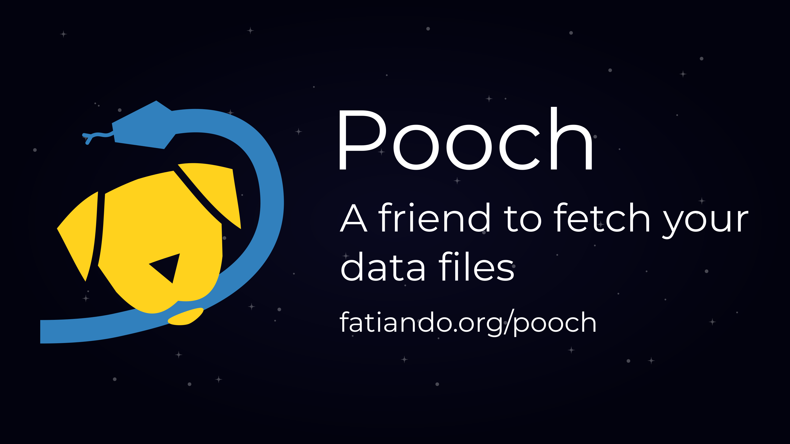

# Pooch: a friend to fetch your data files

[Santiago Soler][santisoler]

| Information | |
|---|---|
| Track  | General  |

<!--

I can add an image in the submission.

The submission can be done in Markdown!

-->

## Abstract

<!--

<= 100 words

- In your abstract, be sure to include answers to some basic questions: Who is
the intended audience for your talk? What, specifically, will attendees learn
from your talk?

-->

<!--
### Brainstorming

- Intended audience:
  - package maintainers, teachers and instructors, end users.
- What will they learn:
  - Package maintainers can use Pooch to easily provide sample datasets in
    gallery examples, tutorials, user guides, etc.
  - Teachers can use Pooch to easily download data files during live coding
    classes, locally or in the cloud, while ensuring that the students have the
    correct file.

What's Pooch? Who can use it? What's is useful for? Who's using it?

-->

Pooch is a Python library that can download and locally cache files from
the web without hassle. Novices can use it to simply download files
in one line of code and focus on the data.
Package maintainers can use it to provide sample datasets
to their users, in examples and tutorials, as libraries like [SciPy][scipy],
[scikit-image][scikit-image], [napari][napari] and [MetPy][metpy] do.
During this talk, we'll show you how you can use the different features that
Pooch offers and also how you can extend its capabilities by writing your own
downloaders or post-processors.

## Description

<!--
Your placement in the program will be based on reviews of your description.
This should be a roughly 500-word outline of your presentation. This outline
should concisely describe software of interest to the SciPy community, tools or
techniques for more effective computing, or how scientific Python was applied
to solve a research problem. A traditional background/motivation, methods,
results, and conclusion structure is encouraged but not required. Links to
project websites, source code repositories, figures, full papers, and evidence
of public speaking ability are encouraged.

Include links to source code, articles, blog posts, or other writing that adds
context to the presentation.

Review process:
- Would you recommend accepting this proposal (yes/no)?
- Proposal rating? (numerical score 1 to 5)
- How confident are you in your review? (numerical score 1 to 5)
- Does this abstract concisely describe software of interest to the SciPy
  community, tools or techniques for more effective computing, or how
  scientific Python was applied to solve a research problem? (numerical score
  1 to 5)

### Brainstorming

- What's Pooch?
- Download and cache files without frills: `retrieve`
- Automatically check file integrity.
- Reuse that cache file.
- For package maintainers, create a `Pooch` object and `fetch` files from
  anywhere.
- Download from anywhere: FTP, Zenodo, figshare, dataverse, etc.
- Unpack archives
- Why it's useful? Why you should use it?
- Extend it however you want: write your own downloaders and post-processors.
- Who's using Pooch?

Links:

- github.com/fatiando/pooch
- www.fatiando.org/pooch
- https://doi.org/10.21105/joss.01943

### Structure

1. Motivation
  - Why Pooch?
  - Maintainers needing a way to provide sample datasets.
  - Easy way to download and cache data files in Python.
2. Methods
  - What Pooch can do?
  - Maybe don't get into too many details and just mention the capabilities.
3. Results
  - Mention who's using it, and positives experiences while teaching.
4. Conclusion
  - Conclude with just some final thoughts, summary of the talk.
-->

Tutorials and examples are among the most critical assets that scientific
Python libraries have to drive the adoption of their tools by the community.
They usually require some sample datasets to demonstrate the capabilities
of their packages and to show how they can be used in comprehensive workflows.
These datasets should be readily available to the users so that they can focus
on learning and not micromanaging file downloads.
Shipping these data files along with the software is cumbersome, and makes the
packages larger than needed.
Alternatively, they could be hosted in a different location, which
introduces the need for an easy way to access them.

[Pooch][pooch] is a slim, pure Python library that allows you to download and
cache files from the web.
It is specifically designed to provide package developers with an easy way to
make their sample datasets available to their users, while also providing extra
features that make it useful in many other scenarios.

With the [`pooch.retrieve()`][pooch.retrieve] function we can download a file
from the web, check its integrity through its checksum, cache it locally in the
desired location, and finally get the path to that file.
If the file has already been downloaded, the function will avoid re-downloading
and simply return its path.

To manage the download of multiple data files, we make use of the
[`pooch.Pooch`][pooch.Pooch] class, which can keep a record of the available
files for download through a _registry_: a dictionary with all remote files and
their hashes.
Then these files can easily be downloaded and cached through the
[`Pooch.fetch()`][Pooch.fetch] method.
The [`Pooch`][pooch.Pooch] class is particularly useful for package
maintainers who want to provide an easy way to download sample datasets for
their libraries, as it supports ways to separate the cached data files for
different versions of their packages.

[Pooch][pooch] supports downloading files using different protocols, like HTTP
and FTP.
It can also download files from repositories like
[Zenodo][zenodo], [figshare][figshare], and [dataverse][dataverse] directly
through their [DOI (Digital object identifier)][doi].
Its modular design allows us to plug in custom downloaders, so we can make it
work with other protocols or APIs.
It also offers a simple way to perform post-download tasks through
_post-processors_. Pooch already includes built-in post-processor classes for
unpacking zip and tar archives and decompressing files.
Users can also write their custom post-processors and easily plug them into
Pooch.

Pooch was created as part of the [Fatiando a Terra][fatiando] project,
a community that develops open-source Python tools for geosciences.
It started as a collaboration between [Fatiando a Terra][fatiando] and
[MetPy][metpy] to standardize how sample datasets are downloaded for gallery
examples and tutorials.
It became popular among the scientific Python community, and nowadays it is
being used by projects like [SciPy][scipy], [scikit-image][scikit-image],
[napari][napari] and [MNE Tools][mne-tools], among others.
Pooch has proved to be useful when running live-coding tutorials, as it allows
instructors and attendees to get their hands on the data without any frills,
and also ensures that they have obtained the right data file.

A peer-reviewed paper about Pooch was published in the [Journal of Open Source
Software][joss] (doi: [10.21105/joss.01943][pooch-doi]), and presented in
a [lightning-talk][pycascades-pooch] at [PyCascades 2023][pycascades2023].

During this talk, we'll show you how you can use the different features that
Pooch offers and also discuss how you can extend its capabilities by writing
your custom downloaders or post-processors.

[santisoler]: https://www.santisoler.com
[fatiando]: https://www.fatiando.org
[pooch]: https://www.fatiando.org/pooch
[pooch.retrieve]: https://www.fatiando.org/pooch/v1.8.1/api/generated/pooch.retrieve.html
[pooch.pooch]: https://www.fatiando.org/pooch/v1.8.1/api/generated/pooch.Pooch.html
[pooch.fetch]: https://www.fatiando.org/pooch/v1.8.1/api/generated/pooch.Pooch.html#pooch.Pooch.fetch
[metpy]: https://unidata.github.io/MetPy
[napari]: https://napari.org
[scipy]: https://scipy.org
[scikit-image]: https://scikit-image.org
[doi]: https://en.wikipedia.org/wiki/Digital_object_identifier
[zenodo]: https://zenodo.org/
[figshare]: https://figshare.com/
[dataverse]: https://dataverse.org/
[mne-tools]: https://mne.tools
[joss]: https://joss.theoj.org/
[pooch-doi]: https://doi.org/10.21105/joss.01943
[pycascades2023]: https://2023.pycascades.com/
[pycascades-pooch]: https://www.youtube.com/watch?v=KvxBc4xUMyg
